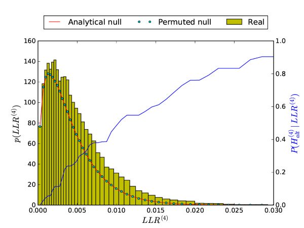
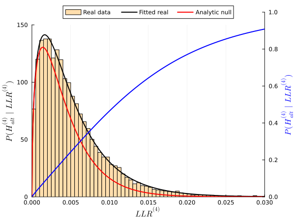

```@meta
CurrentModule = Findr
```

# Bayesian inference of posterior probabilities

After obtaining the PDFs for the LLRs from real data and the null hypotheses, we can convert LLR values into posterior probabilities ``P({\mathcal H}_{\mathrm{alt}}\mid \mathrm{LLR})``. We use a similar technique as in [^Chen2007], which itself was based on a more general framework to estimate local FDRs in genome-wide studies [^Storey2003]. This framework assumes that the real distribution of a certain test statistic forms a mixture distribution of null and alternative hypotheses. After estimating the null distribution, either analytically or by simulation, it can be compared against the real distribution to determine the proportion of null hypotheses, and consequently the posterior probability that the alternative hypothesis is true at any value of the statistic.

[^Chen2007]: Chen L, Emmert-Streib F, Storey J. [Harnessing naturally randomized transcription to infer regulatory relationships among genes](https://doi.org/10.1186/gb-2007-8-10-r219). Genome Biol 8, R219 (2007).

[^Storey2003]: Storey JD, Tibshirani R. [Statistical significance for genomewide studies](https://doi.org/10.1073/pnas.1530509100). Proceedings of the National Academy of Sciences. 2003;100(16):9440–9445.

To be precise, consider an arbitrary likelihood ratio test. The fundamental assumption is that in the limit ``\mathrm{LLR}\rightarrow 0^+``, all test cases come from the null hypothesis (``{\mathcal H}_{\mathrm{null}}``), whilst as ``\mathrm{LLR}`` increases, the proportion of alternative hypotheses (``{\mathcal H}_{\mathrm{alt}}``) also grows. The mixture distribution of real LLR values is assumed to have a PDF as

```math
p(\mathrm{LLR}) = P({\mathcal H}_{\mathrm{null}}) p(\mathrm{LLR}\mid{\mathcal H}_{\mathrm{null}}) + P({\mathcal H}_{\mathrm{alt}})p(\mathrm{LLR}\mid{\mathcal H}_{\mathrm{alt}}).
```

The priors ``P({\mathcal H}_{\mathrm{null}})`` and ``P({\mathcal H}_{\mathrm{alt}})`` sum to unity and correspond to the proportions of null and alternative hypotheses in the mixture distribution. For any test ``i=0,\dots,5``, Bayes' theorem then yields its posterior probability as

```math
P({\mathcal H}_{\mathrm{alt}}^{(i)}\mid\mathrm{LLR}^{(i)}) = \frac{p(\mathrm{LLR}^{(i)}\mid{\mathcal H}_{\mathrm{alt}}^{(i)})}{p(\mathrm{LLR}^{(i)})}P({\mathcal H}_{\mathrm{alt}}^{(i)}).
```

Based on this, we can define the posterior probabilities of the selected hypotheses according to the table in the [General inference algorithm](@ref) section, i.e. the alternative for tests 0, 1, 2, 4, 5
and the null for test 3 as

```math
P_i\equiv \begin{cases}
    P({\mathcal H}_{\mathrm{alt}}^{(i)}\mid\mathrm{LLR}^{(i)}), & i=0,1,2,4,5\\
    P({\mathcal H}_{\mathrm{null}}^{(i)}\mid\mathrm{LLR}^{(i)}),&i=3
\end{cases}
``` 

Distributions can be estimated either separately for every ``(E,A)`` pair or by pooling across all ``(E,A)`` pairs. In practice, we test on the order of ``10^3`` to ``10^4`` candidate targets ("``B``") for every ``(E,A)`` such that a separate conversion of LLR values to posterior probabilities is both feasible and recommended, as it accounts for different roles of every gene, especially hub genes, through different rates of alternative hypotheses.

Lastly, in a typical application of Findr, inputs of ``(E,A)`` pairs will have been pre-determined as the set of significant eQTL-gene pairs from a genome-wide eQTL associaton analysis. In such cases, we may naturally assume ``P_1=1`` for all considered pairs, and skip the primary test.

## Estimation

To estimate posterior probabilities, the original method[^Wang2017] approximated PDFs with histograms. This requires proper choices of histogram bin widths, ``P({\mathcal H}_{\mathrm{null}})``, and techniques to ensure the conversion from LLR to posterior probability is monotonically increasing and smooth.

[^Wang2017]: Wang L, Michoel T (2017) [Efficient and accurate causal inference with hidden confounders from genome-transcriptome variation data](https://doi.org/10.1371/journal.pcbi.1005703). PLoS Comput Biol 13(8): e1005703.

[Findr.jl](https://github.com/tmichoel/Findr.jl) uses an alternative, parametric approach, where the basic hypothesis is that the alternative distribution ``p(\mathrm{LLR}\mid{\mathcal H}_{\mathrm{alt}})`` for each test also follows an [`LBeta`](@ref) distribution, that is, belongs to the same 2-parameter family of distributions as the null distributions. 

Let us denote the random variable ``X=\mathrm{LLR}`` taking values ``x\geq 0``, and ``\pi_0=P({\mathcal H}_{\mathrm{null}})``. Our assumption is that

```math
X \sim \pi_0 \mathcal{D}(\alpha_0,\beta_0) + (1-\pi_0) \mathcal{D}(\alpha,\beta)
```

or

```math
p(x) = \pi_0 p(x \mid \alpha_0,\beta_0) + (1-\pi_0) p(x\mid \alpha,\beta)
```

where ``\mathcal{D}`` denotes an [`LBeta`](@ref) distribution with its PDF  ``p(x\mid \alpha,\beta)`` defined in [Null distributions of the log-likelihood ratios](@ref). 

Since the parameters ``\alpha_0`` and ``\beta_0`` of the null distribution are know exactly (see [Null distributions of the log-likelihood ratios](@ref)), it reamins to estimate ``\pi_0``, ``\alpha``, and ``\beta`` from a set of random samples ``x_1, x_2,\dots,x_n`` of ``X``.

### Estimating ``\pi_0``

To estimate ``\pi_0`` we convert the samples ``x_1, x_2,\dots,x_n`` to p values under the null hypothesis,

```math
p_i = P(X\geq x_i \mid {\mathcal H}_{\mathrm{null}}) = \int_{x_i}^\infty p(x \mid \alpha_0,\beta_0) = \mathrm{ccdf}(x_i\mid \alpha_0,\beta_0) 
```

where ``\mathrm{ccdf}`` denotes the complementary CDF. The histogram of p-values would show the [characteristic shape of a set of anti-conservative p-values](http://varianceexplained.org/statistics/interpreting-pvalue-histogram/) and ``\pi_0`` can be estimated by a [robust bootstrap procedure](http://varianceexplained.org/files/pi0boot.pdf):

```@docs
pi0est
```

### Estimating ``\alpha`` and ``\beta``

To estimate ``\alpha`` and ``\beta`` we make use of the relation between the [`LBeta`](@ref) and Beta distributions (see [Null distributions of the log-likelihood ratios](@ref)). Define the random variable

```math
Y = 1 - e^{-2 X}
```

Since each component of the mixture distribution of ``X`` follows an [`LBeta`](@ref) distribution, it follows that ``Y`` follows a mixture of Beta distributions,

```math
Y \sim \pi_0 B\Bigl(\frac{\alpha_0}{2},\frac{\beta_0}{2}\Bigr) + (1 - \pi_0) B\Bigl(\frac{\alpha}{2},\frac{\beta}{2}\Bigr)
```

This result can be derived as follows. The function ``g(x)= 1-e^{-2x}`` increases monotonically for ``x\geq 0`` and has the inverse ``g^{-1}(y)=-\frac{1}{2}\ln(1-y)``. By the usual rules of transforming random variables:

```math
\begin{aligned}
    P(Y\leq y) &= P(1 - e^{-2 X} \leq y) \\
    &= P(X \leq g^{-1}(y))\\
    &= \pi_0 P(X \leq g^{-1}(y) \mid \alpha_0,\beta_0) + (1-\pi_0) P(X \leq g^{-1}(y) \mid \alpha,\beta)\\
    &= \pi_0 F_0(g^{-1}(y)) + (1-\pi_0) F_1(g^{-1}(y))\\
    &= \pi_0 G_0(y) + (1-\pi_0) G_1(y)
\end{aligned}
```

where ``F_0`` and ``F_1`` are the CDFs of random variables with distributions ``\mathcal{D}(\alpha_0,\beta_0)`` and ``\mathcal{D}(\alpha,\beta)``, respectively, and ``G_0`` and ``G_1`` are the CDFs of random variables with distributions ``B(\alpha_0/2,\beta_0/2)`` and ``B(\alpha/2,\beta/2)``. The last step used the transformation between [`LBeta`](@ref) and Beta distribution derived in  [Null distributions of the log-likelihood ratios](@ref).

The parameters of a Beta distribution relate to [its first and second moment](https://en.wikipedia.org/wiki/Beta_distribution#Higher_moments) as follows: if ``Z\sim B(a,b)``, then

```math
\begin{aligned}
    \mathbb{E}(Z) &= \frac{a}{a+b} \equiv m_1(a,b)\\
    \mathbb{E}(Z^2) &= \mathbb{E}(Z) \frac{a+1}{a+b+1} \equiv m_2(a,b)
\end{aligned}
```

Conversely, if first and second moments ``m_1`` and ``m_2`` are given, these equations can be inverted to give the parameters

```math
\begin{aligned}
    a &= \frac{m_1(m_1-m_2)}{(m_2-m_1^2)}\\
    b &= \frac{(1-m_1)(m_1-m_2)}{(m_2-m_1^2)}
\end{aligned}
```

Multiplying by two then gives the parameters of an [`LBeta`](@ref) distribution given the moments of the corresponding Beta distribution:

```@docs
fit_mom
```

For the mixture distributed ``Y``, we have

```math
\mathbb{E}(Y^k) = \pi_0 \mathbb{E}(Y^k \mid \alpha_0,\beta_0) + (1-\pi_0) \mathbb{E}(Y^k \mid \alpha,\beta)
```

and hence

```math
\begin{aligned}
    \mathbb{E}(Y) &= \pi_0 m_1\bigl(\alpha_0/2,\beta_0/2\bigr) + (1-\pi_0) m_1\bigl(\alpha/2,\beta/2\bigr)\\
    \mathbb{E}(Y^2) &= \pi_0 m_2\bigl(\alpha_0/2,\beta_0/2\bigr) + (1-\pi_0) m_2\bigl(\alpha/2,\beta/2\bigr)
\end{aligned}
```

or

```math
\begin{aligned}
    m_1\bigl(\alpha/2,\beta/2\bigr) &= \frac{\mathbb{E}(Y) - \pi_0 m_1\bigl(\alpha_0/2,\beta_0/2\bigr)}{(1-\pi_0)}\\
    m_2\bigl(\alpha/2,\beta/2\bigr) &= \frac{\mathbb{E}(Y^2) - \pi_0 m_2\bigl(\alpha_0/2,\beta_0/2\bigr)}{(1-\pi_0)}
\end{aligned}
```

Given samples ``x_1, x_2,\dots,x_n`` we transform them to

```math
y_i = 1 - e^{-2 x_i}
```

and replace ``\mathbb{E}(Y)`` and ``\mathbb{E}(Y^2)`` in these equations by their estimates ``\frac{1}{n}\sum_i y_i`` and ``\frac{1}{n}\sum_i y_i^2``, respectively. Likewise we replace ``\pi_0`` by its estimate ``\hat{\pi}_0`` obtained as explained above (see [`pi0est`](@ref)). Since ``\alpha_0`` and ``\beta_0`` are known exactly, we obtain estimates ``\hat{m}_1`` and ``\hat{m}_2`` for the moments of a Beta distribution with parameters ``\alpha/2`` and ``\beta/2``. Plugging these moment estimates in the [`fit_mom`](@ref) function gives estimates ``\hat{\alpha}`` and ``\hat{\beta}`` for the corresponding [`LBeta`](@ref).

To make this estimated distribution a valid alternative distribution component of the LLRs mixture distribution, we need to ensure the validity of two edge cases:

- In the limit $\mathrm{LLR}\to 0^+$, all cases must come from the null distribution. This will be the case if $\hat{\alpha} \geq \alpha_0$, and if this is not the case, we set $\hat{\alpha} = \alpha_0$.
- In the limit $\mathrm{LLR}\to \infty$, all cases must come from the alternative distribution. This will be the case if $\hat{\beta} \leq \beta_0$, and if this is not the case, we set $\hat{\beta} = \beta_0$.

The entire procedure is implemented in the `fit_mixdist_mom` function:

```@docs
fit_mixdist_mom
```

## Diagnostics

An important advantage of having a parametric solution for the observed LLR distributions, in the form of a [mixture model object](https://juliastats.org/Distributions.jl/stable/mixture/), is that its fit to the data can be evaluated easily. In this case, p-values for the real data under the real distribution must be uniformly distributed. Formally, if $X$ is a continuous, univariate random variable with CDF $F_X$, then the transformed random variable

$$
P = 1 - F_X(X) \sim U(0,1)
$$

where $U(0,1)$ is the [uniform distribution](https://en.wikipedia.org/wiki/Continuous_uniform_distribution) on the unit interval.

## Comparison

Old method | New method
:-------------: | :-------------:
 | 